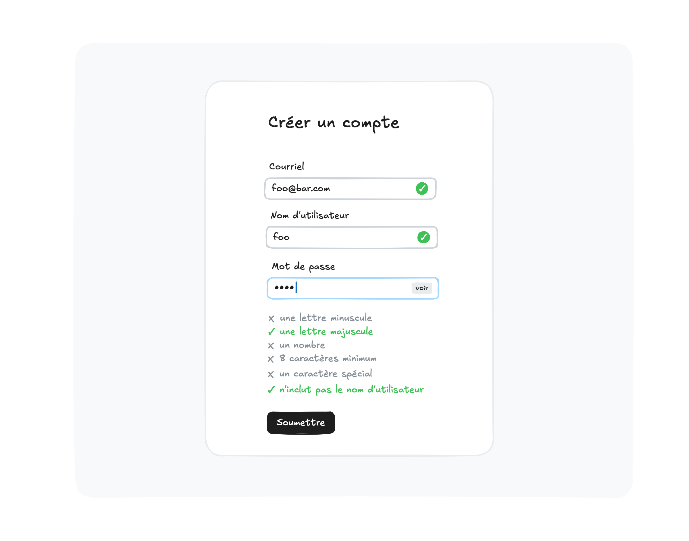

# Projet 3 : Formulaire

> Pondération : 30% \
> Remise : avant le dernier cours

Pour ce dernier projet, on vous demande de concevoir un formulaire
d'inscription pour un site web quelconque, et d'améliorer celui-ci
progressivement à l'aide de JavaScript. Vous trouverez ci-dessous les
exigences.

## Exigences

Le formulaire doit contenir les contrôles nécessaires pour saisir un
courriel, un nom d'utilisateur·rice, et un mot de passe. Ces trois
contrôles sont requis pour s'inscrire.

Votre tâche concerne la validation seulement. Vous n'avez pas à gérer
l'inscription une fois que le formulaire a été soumis avec succès.

### Contrôles

-   Le courriel saisit par l'utilisateur·rice doit être un courriel
    valide. De plus, le courriel doit être unique. Si le courriel donné
    est associé à un compte préexistant, un message d'erreur doit
    apparaître lors de la validation du formulaire. Vous trouverez dans
    votre dépôt un fichier nommé `accounts.ts` qui exporte un tableau
    contenant les comptes existants.

-   Le nom d'utilisateur·rice ne peut pas contenir d'espace.

-   Le mot de passe saisit par l'utilisateur·rice doit contenir au
    minimum 8 caractères, incluant une lettre minuscule, une lettre
    majuscule, un nombre, et un caractère parmi les suivants : 
    « @#$%&* ». De plus, le mot de passe ne doit pas inclure le nom
    d'utilisateur·rice. 

-   Lorsque le contrôle pour saisir le mot de passe obtient le focus,
    une liste des critères doit apparaître en dessous du contrôle. Au
    fur et à mesure que ces critères sont satisfaits, vous devez
    l'indiquer visuellement à l'utilisateur·rice.

-   Un bouton doit permettre de montrer ou de cacher le mot de passe.

### Rétroaction

-   Pour chaque contrôle, une rétroaction *positive* est donnée
    immédiatement lorsque la valeur du contrôle change et que celle-ci
    est valide. Ainsi, un crochet vert apparaît près du contrôle dès que
    sa valeur est acceptable.

-   Une rétroaction *négative* est donnée à l'utilisateur·rice seulement
    lorsque le formulaire est soumis. Si un contrôle est invalide, un 
    « X » rouge apparaît prêt de celui-ci, et un court message explique
    l'erreur.

### Implémentation

-   Les fonctions responsables de la validation doivent être testées
    avec des tests unitaires. Ces fonctions ne doivent donc pas dépendre
    du DOM.

-   Portez attention à l'expérience des utilisateur·rices qui n'ont pas
    accès à JavaScript. La liste des critères pour le mot de passe, par
    exemple, devrait être visible par défaut pour ces personnes, même si
    celle-ci ne sera pas mise à jour en temps réel.

## Conseils

-   Commencez par le balisage, puis ajoutez les feuilles de style, puis
    les scripts. Rappelez-vous que le bon fonctionnement d'une page web
    ne devrait pas dépendre de CSS ou JavaScript. Utilisez JavaScript
    seulement pour les éléments dynamiques ou les fonctionnalités
    interactives de la page.

-   Autant que possible, utilisez les [contraintes de validation
    HTML][]. Plus vous utilisez les fonctionnalités natives du
    navigateur, moins vous avez à travailler.

[contraintes de validation HTML]:
https://developer.mozilla.org/fr/docs/Learn/Forms/Form_validation#api_de_contraintes_de_validation_html5

## Remise

Le travail doit être remis dans un dépôt GitHub Classroom créé à cet
effet. Pour créer le dépôt, cliquez [ici][GitHub Classroom].

[GitHub Classroom]: https://classroom.github.com/a/GQyMKWuL
